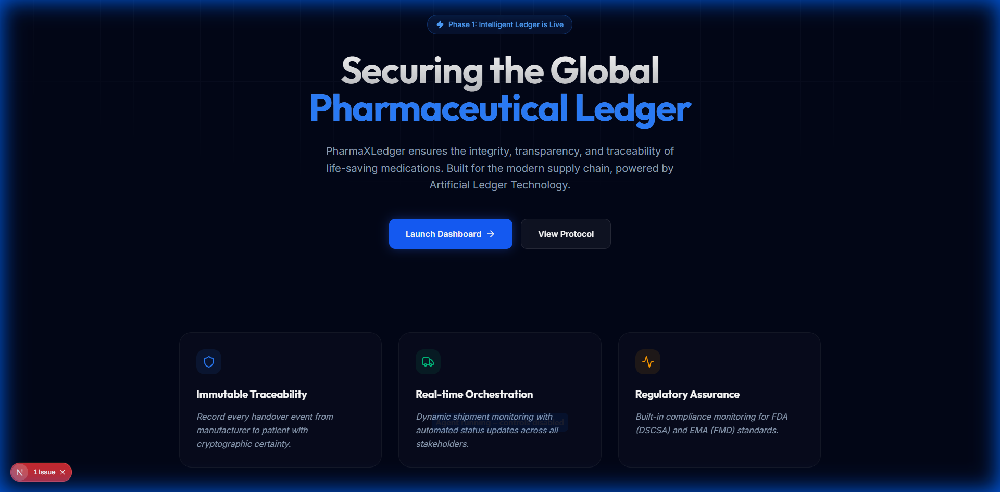

# 🏥 PharmaXLedger: Secure Pharmaceutical Supply Chain

[](https://opensource.org/licenses/MIT)
[-blue.svg)](https://pharmaxledger.ai)
[](https://nextjs.org/)

PharmaXLedger is a state-of-the-art pharmaceutical supply chain management platform designed to ensure the integrity, transparency, and traceability of life-saving medications. Built with a focus on high-stakes tracking, it bridges the gap between traditional centralized management and future decentralized immutable ledgers.



---


## 🏗️ Architectural Overview

### Phase 1: Robust Centralized Ledger
- **Framework**: Next.js 15 (App Router, Server Actions)
- **Database**: Supabase (PostgreSQL) with Prisma ORM
- **Authentication**: Role-based access control (RBAC) via Supabase Auth
- **UI/UX**: Tailwind CSS + Shadcn UI + Framer Motion for a premium, high-fidelity experience.

### Phase 2: Decentralized Evolution
- **Web3 Integration**: Migrating the ledger to a blockchain (Polygon/Ethereum) for immutability.
- **Smart Contracts**: Automated compliance and payment triggers upon verified delivery.
- **DIDs**: Decentralized Identifiers for all stakeholders.

### Phase 3: IoT & AI Sentinel
- **IoT Integration**: Live temperature and location tracking via smart sensors.
- **AI Monitoring**: Predictive analytics for shelf-life and route anomaly detection.

### Phase 4: Global Compliance & Interop
- **GS1 Standards**: Universal pharmaceutical identification compliance.
- **Regulatory Vault**: Automated FDA/EMA compliance reporting.

### Phase 5: Sustainable Ecosystem
- **ESG Ledger**: Tracking carbon footprint of medical logistics.
- **Supply Chain Finance**: Verified delivery proofs unlocking instant liquidity.

---

## 📦 Core Data Entities

| Entity | Description | Key Attributes |
| :--- | :--- | :--- |
| **Drug** | Major life-saving medications | Humira, Keytruda, Eliquis, Revlimid, Stelara, Opdivo |
| **Shipment** | Tracking the movement of batches | Tracking ID, Status, Temperature sensor data (Future) |
| **Handover** | Ledger entry for change of custody | Timestamp, Digital Signature, Location Coordinates |
| **Stakeholder** | Participants in the chain | Manufacturer, Distributor, Pharmacist, Patient |

---

## 📂 Project Repository Structure

```text
PharmaXLedger/
├── app/                # Next.js 15 App Router
│   ├── (auth)/         # Login, Registration paths
│   ├── dashboard/      # Stakeholder-specific views
│   ├── api/            # Server Action endpoints
│   └── layout.tsx      # Global theme & glassmorphism layout
├── components/         # Premium Shadcn UI components
├── lib/                # Prisma client, validation logic, utils
├── prisma/             # Schema definitions and migrations
├── public/             # High-res assets & drug logos
└── styles/             # Global CSS & Tailwind config
```

---

## 📜 Changelog

### [v1.0.0-phase1] - 2025-12-24
- **Refactor**: Complete slate of the previous Convex/Vite codebase.
- **Added**: Next.js 15 project scaffolding.
- **Added**: Prisma schema for supply chain traceability.
- **Added**: Premium UI design system using Framer Motion.
- **Project Goal**: Establish a rock-solid Phase 1 foundation for upcoming Web3 integration.

---

## 🤝 Contribution & Team

This project is a high-stakes collaborative effort. We welcome contributions that maintain the highest standards of code integrity and security.

- **Lead Developer**: [Jay Arre Talosig](https://github.com/flexycode)
- **QA Lead**: [Brian Carlo De Vera](https://github.com/scarfer14)
- **Architecture**: [Artificial Ledger Technology](https://github.com/Artificial-Ledger-Technology)  

---

## 📄 License

This project is licensed under the **MIT License**. See the `LICENSE` file for details.

---

> [!IMPORTANT]
> This repository is currently in **Phase 1 (Development)**. The focus is on API stability and UI excellence before moving to the blockchain integration phase.
