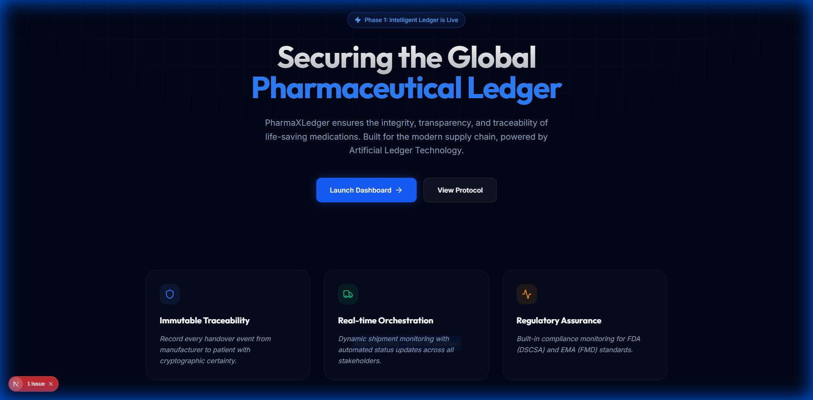
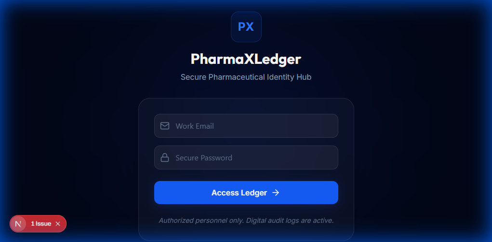
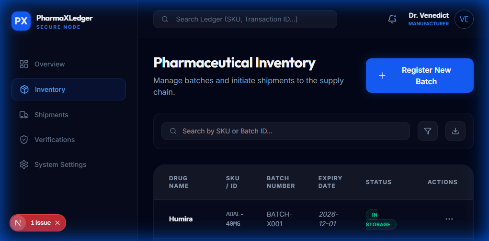
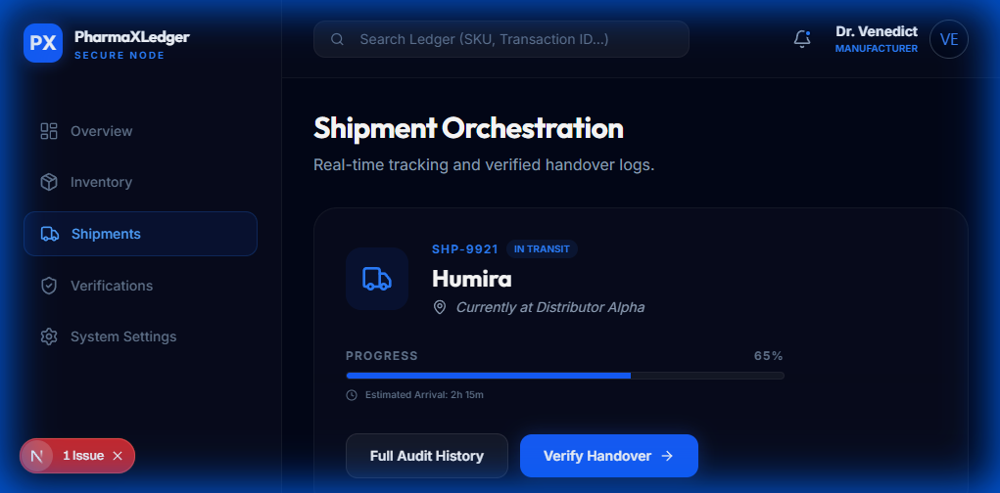
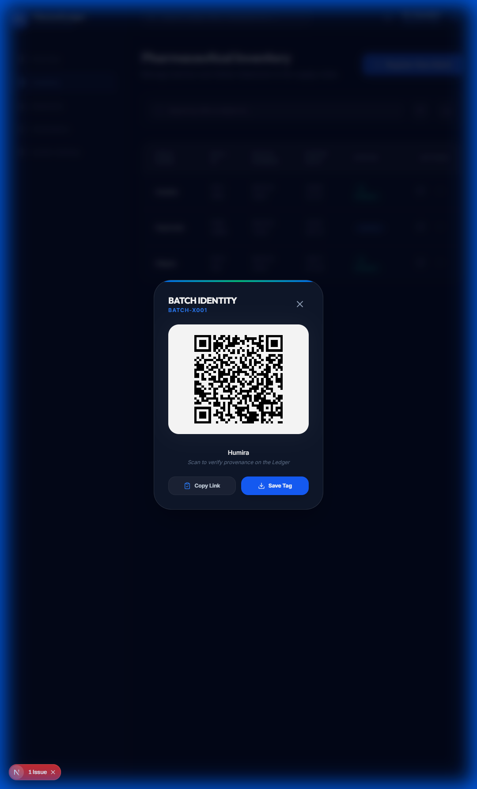
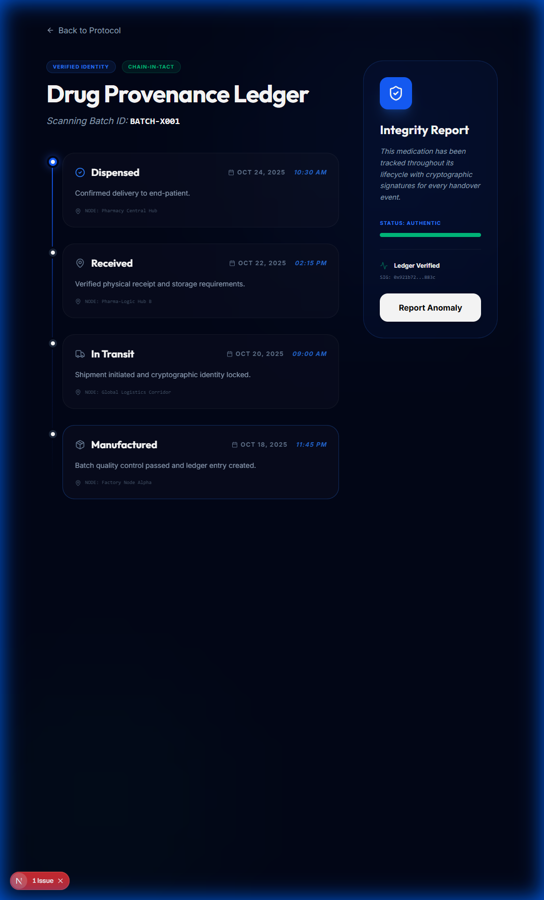

# 🏥 PharmaXLedger: Secure Pharmaceutical Supply Chain

[](https://opensource.org/licenses/MIT)
[-blue.svg)](https://pharmaxledger.ai)
[](https://nextjs.org/)

PharmaXLedger is a state-of-the-art pharmaceutical supply chain management platform designed to ensure the integrity, transparency, and traceability of life-saving medications. Built with a focus on high-stakes tracking, it bridges the gap between traditional centralized management and future decentralized immutable ledgers.



---

## 🖥️ Executive Dashboards (Phase 1.1)

PharmaXLedger now features high-fidelity, role-specific dashboards for key supply chain stakeholders.



<!-- slide -->

<!-- slide -->



### Key Capabilities:
- **Manufacturer Hub**: High-detail inventory management and batch registration logic.
- **Logistics Orchestration**: Real-time tracking of custody transfers and shipment progress.
- **Identity Hub**: Secure, glassmorphism-based authentication via Supabase Auth.
- **Digital Ledger**: Every action (Manufacture, Ship, Receive, Dispense) is recorded as a high-integrity transaction.

---

## 🧬 Digital Provenance & QR Tracking (Phase 1.2)

PharmaXLedger now provides full end-to-end transparency with a integrated digital identity system.



<!-- slide -->



### Traceability Features:
- **Digital Twins**: Unique QR identifiers generated for every drug batch upon registration.
- **Visual Ledger**: An interactive, animated timeline for patients to verify the journey of their medication.
- **Integrity Validation**: Real-time monitoring of the supply chain with cryptographic "Chain-In-Tact" verification.
- **Deep Linking**: Instant access to provenance data via mobile-ready QR codes.

---

## ⚙️ Environment Setup

To enable the full functionality of the Ledger, you must configure your Supabase credentials in a `.env` file at the root of the project:

```env
# Database connection for Prisma
DATABASE_URL="postgresql://postgres:[PASSWORD]@[HOST]:5432/postgres?schema=public"

# Supabase Auth & API Configuration
NEXT_PUBLIC_SUPABASE_URL="https://your-project-id.supabase.co"
NEXT_PUBLIC_SUPABASE_ANON_KEY="your-anon-key"
```

> [!IMPORTANT]
> Ensure that your Supabase roles match the expected `Role` enum in `schema.prisma` (MANUFACTURER, DISTRIBUTOR, PHARMACIST, PATIENT) to allow proper routing.

---

## 🏗️ Architectural Overview


### Phase 1: Robust Centralized Ledger
- **Framework**: Next.js 15 (App Router, Server Actions)
- **Database**: Supabase (PostgreSQL) with Prisma ORM
- **Authentication**: Role-based access control (RBAC) via Supabase Auth
- **UI/UX**: Tailwind CSS + Shadcn UI + Framer Motion for a premium, high-fidelity experience.

### Phase 2: Decentralized Evolution
- **Web3 Integration**: Migrating the ledger to a blockchain (Polygon/Ethereum) for immutability.
- **Smart Contracts**: Automated compliance and payment triggers upon verified delivery.
- **DIDs**: Decentralized Identifiers for all stakeholders.

### Phase 3: IoT & AI Sentinel
- **IoT Integration**: Live temperature and location tracking via smart sensors.
- **AI Monitoring**: Predictive analytics for shelf-life and route anomaly detection.

### Phase 4: Global Compliance & Interop
- **GS1 Standards**: Universal pharmaceutical identification compliance.
- **Regulatory Vault**: Automated FDA/EMA compliance reporting.

### Phase 5: Sustainable Ecosystem
- **ESG Ledger**: Tracking carbon footprint of medical logistics.
- **Supply Chain Finance**: Verified delivery proofs unlocking instant liquidity.

---

## 📦 Core Data Entities

| Entity | Description | Key Attributes |
| :--- | :--- | :--- |
| **Drug** | Major life-saving medications | Humira, Keytruda, Eliquis, Revlimid, Stelara, Opdivo |
| **Shipment** | Tracking the movement of batches | Tracking ID, Status, Temperature sensor data (Future) |
| **Handover** | Ledger entry for change of custody | Timestamp, Digital Signature, Location Coordinates |
| **Stakeholder** | Participants in the chain | Manufacturer, Distributor, Pharmacist, Patient |

---

## 📂 Project Repository Structure

```text
PharmaXLedger/
├── prisma/             # Schema definitions and database configuration
├── public/             # High-res screenshots, logos, and static assets
└── src/
    ├── app/            # Next.js 15 App Router (Dashboards, Routing, Auth)
    │   ├── (auth)/     # Secure Login & Identity Hub
    │   ├── dashboard/  # Role-specific stakeholder environments
    │   ├── track/      # Public provenance ledger engine
    │   └── layout.tsx  # Global glassmorphism theme & styles
    ├── components/     # Specialized UI components (Dashboards, QR Modals)
    ├── lib/            # Server actions, Supabase clients, and logic
    └── styles/         # Global typography & Tailwind design tokens
```


---

## 📜 Changelog

### [v1.0.0-phase1] - 2025-12-24
- **Refactor**: Complete slate of the previous Convex/Vite codebase.
- **Added**: Next.js 15 project scaffolding.
- **Added**: Prisma schema for supply chain traceability.
- **Added**: Premium UI design system using Framer Motion.
- **Project Goal**: Establish a rock-solid Phase 1 foundation for upcoming Web3 integration.

---

## 🤝 Contribution & Team

This project is a high-stakes collaborative effort. We welcome contributions that maintain the highest standards of code integrity and security.

- **Blockchain Developer**: [Jay Arre Talosig](https://github.com/flexycode)
- **QA Engineer**: [Brian Carlo De Vera](https://github.com/scarfer14)
- **Full Stack Engineer**: [Anthonee Buno](https://github.com/Leirk04)
- **Architecture**: [Artificial Ledger Technology](https://github.com/Artificial-Ledger-Technology)  

---

## 📄 License

This project is licensed under the **MIT License**. See the `LICENSE` file for details.

---

> [!IMPORTANT]
> This repository is currently in **Phase 1 (Development)**. The focus is on API stability and UI excellence before moving to the blockchain integration phase.


<!-- Genshin Impact -->
<div align="center">

</div>

<!-- End point line insert Comeback again next time, feel free to modify this  -->
<p align="center">

</p>

</p>
    
<br>
<!-- End point insert background effect line of sight color red -->

